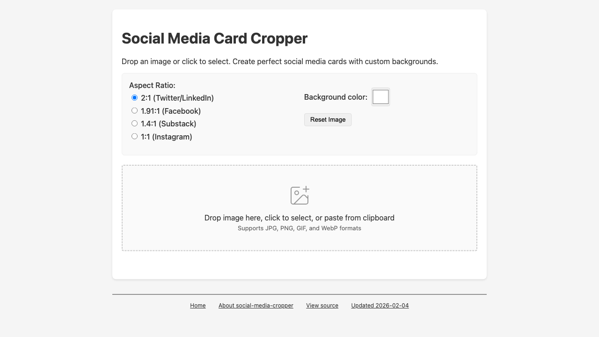
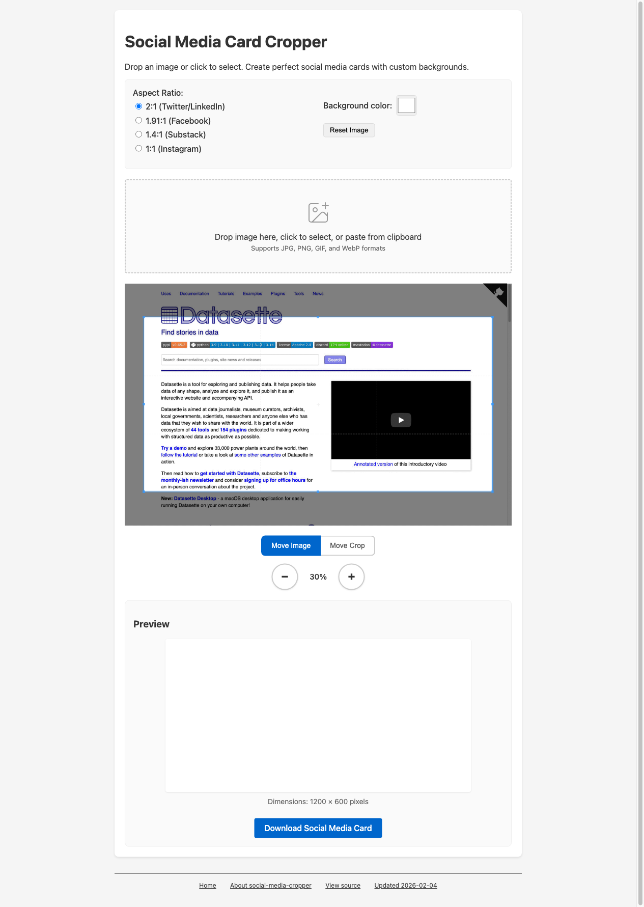
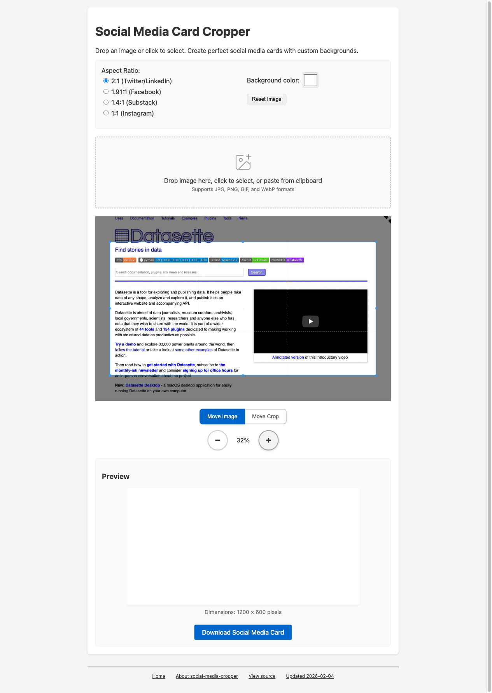

# Using Rodney to Crop an Image with the Social Media Cropper

*2026-02-10T14:37:42Z*

This demonstrates using Rodney to automate the [Social Media Card Cropper](https://tools.simonwillison.net/social-media-cropper) - opening a web page, uploading a GIF image via a file input, adjusting the crop, and downloading the result.

First, start a headless Chrome instance:

```bash
./rodney start
```

```output
Chrome started (PID 9829)
Debug URL: ws://127.0.0.1:50172/devtools/browser/420ac2aa-1736-4c33-8b06-7d20441d4872
```

Navigate to the Social Media Card Cropper:

```bash
./rodney open https://tools.simonwillison.net/social-media-cropper
```

```output
Social Media Card Cropper
```

Take a screenshot to see the initial state of the page:

```bash {image}
./rodney screenshot -w 1280 -h 720 initial.png && echo initial.png
```



Upload the `out.gif` image using the file input. The new `file` command sets files on `<input type=\"file\">` elements, just as if the user had picked the file through the browser dialog:

```bash
./rodney file "#fileInput" out.gif
```

```output
Set file: out.gif
```

```bash
./rodney sleep 1
```

```output
```

Screenshot after the image is loaded in the cropper:

```bash {image}
./rodney screenshot -w 1280 loaded.png && echo loaded.png
```



Zoom in to better fill the crop area:

```bash
./rodney click "#zoomInBtn"
```

```output
Clicked
```

```bash
./rodney js "document.getElementById(\"zoomValue\").textContent"
```

```output
32%
```

```bash {image}
./rodney screenshot -w 1280 zoomed.png && echo zoomed.png
```


