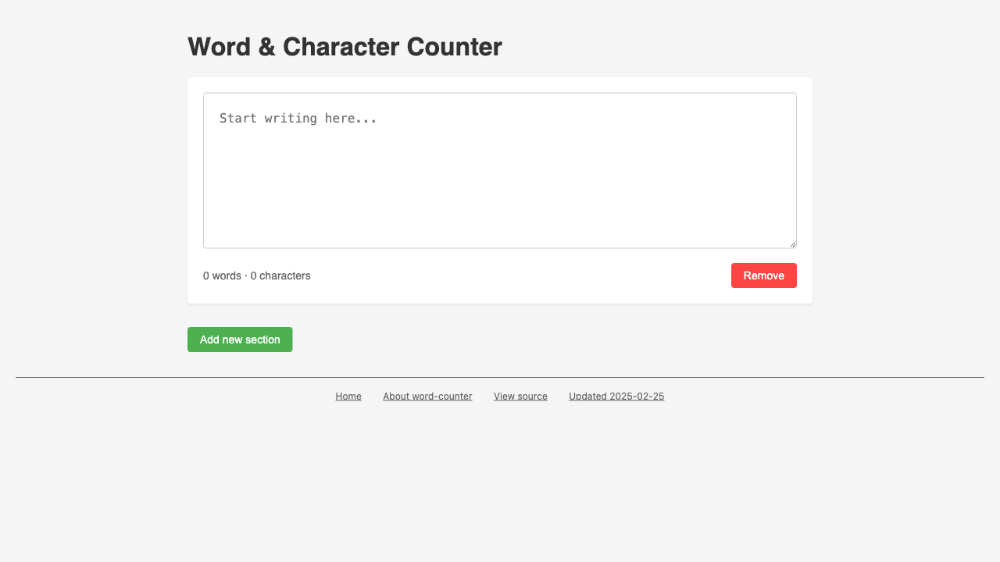
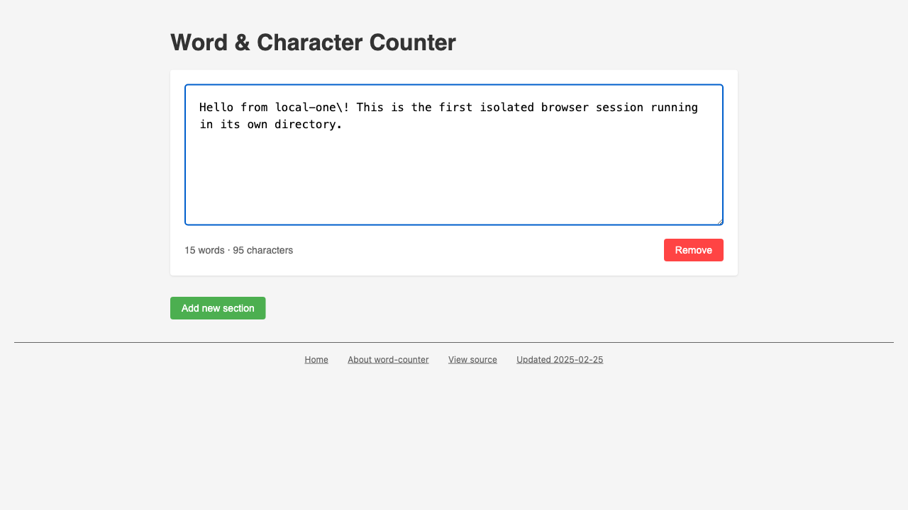
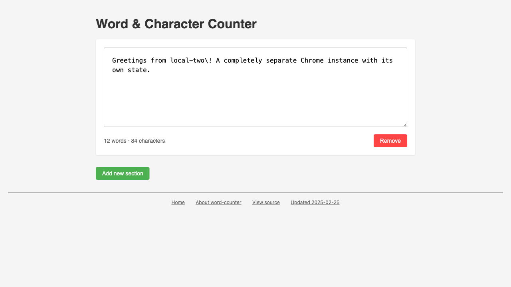
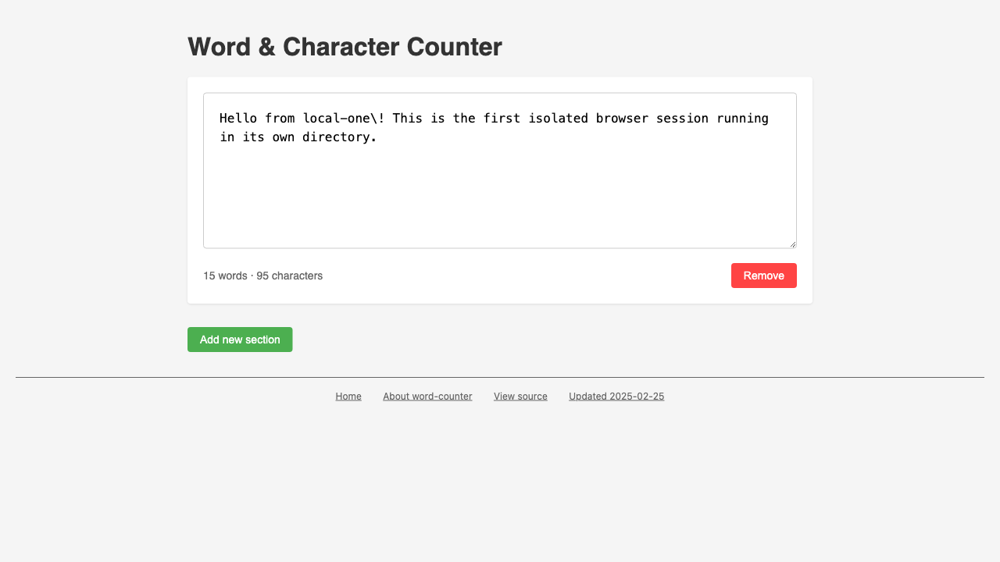

# Directory-Scoped Sessions with --local

*2026-02-17T17:26:04Z by Showboat 0.6.0*
<!-- showboat-id: 21fea7ad-568e-4b54-9ffd-55907cb69060 -->

The most recent commit (01aaede) adds directory-scoped sessions to rodney via `--local` and `--global` flags. When started with `--local`, rodney stores its state in `./.rodney/` in the current directory instead of the global `~/.rodney/`. This means each directory gets its own isolated Chrome instance, cookies, localStorage, and state.

We'll demonstrate this with two separate directories, each visiting the same page but maintaining completely independent browser sessions.

## Setting up two local sessions

Start a local rodney session in each of our two directories:

First, build the development binary:

```bash
cd ../.. && go build -o notes/local-sessions-demo/rodney . && echo "Built ./rodney"
```

```output
Built ./rodney
```

Start a local rodney session in each directory:

```bash
cd local-one && ../rodney start --local 2>&1
```

```output
Chrome started (PID 81059)
Debug URL: ws://127.0.0.1:65310/devtools/browser/a9ccf891-8cbe-41df-809b-e4709a11c000
```

```bash
cd local-two && ../rodney start --local 2>&1
```

```output
Chrome started (PID 81567)
Debug URL: ws://127.0.0.1:65320/devtools/browser/2f49fd9c-c7b7-4d4b-9ee8-6df87bb737e4
```

Each directory now has its own `.rodney/` folder with independent state and Chrome user data:

```bash
ls -lah local-one/.rodney/
```

```output
total 8
drwxr-xr-x@  4 simon  staff   128B Feb 17 09:30 .
drwxr-xr-x@  3 simon  staff    96B Feb 17 09:29 ..
drwxr-xr-x@ 35 simon  staff   1.1K Feb 17 09:30 chrome-data
-rw-r--r--@  1 simon  staff   243B Feb 17 09:30 state.json
```

```bash
ls -lah local-two/.rodney/
```

```output
total 8
drwxr-xr-x@  4 simon  staff   128B Feb 17 09:30 .
drwxr-xr-x@  3 simon  staff    96B Feb 17 09:29 ..
drwxr-xr-x@ 35 simon  staff   1.1K Feb 17 09:30 chrome-data
-rw-r--r--@  1 simon  staff   243B Feb 17 09:30 state.json
```

## Visiting the same page in both sessions

Navigate both browsers to the same word counter tool:

```bash
cd local-one && ../rodney open https://tools.simonwillison.net/word-counter
```

```output
Word & Character Counter
```

```bash
cd local-two && ../rodney open https://tools.simonwillison.net/word-counter
```

```output
Word & Character Counter
```

Both sessions show the same empty word counter:

```bash {image}
local-one-initial.png
```



```bash {image}
local-two-initial.png
```


## Writing different text in each session

Type different text into each browser to demonstrate they are independent:

```bash
cd local-one && ../rodney click textarea && ../rodney input textarea "Hello from local-one\! This is the first isolated browser session running in its own directory."
```

```output
Clicked
Typed: Hello from local-one\! This is the first isolated browser session running in its own directory.
```

```bash
cd local-two && ../rodney click textarea && ../rodney input textarea "Greetings from local-two\! A completely separate Chrome instance with its own state."
```

```output
Clicked
Typed: Greetings from local-two\! A completely separate Chrome instance with its own state.
```

```bash {image}
local-one-typed.png
```



```bash {image}
local-two-typed.png
```



## Proving localStorage persistence across restarts

Stop both Chrome instances and restart them. The word counter stores text in localStorage, so if the per-directory Chrome data works correctly, each session should remember its own text:

```bash
cd local-one && ../rodney stop
```

```output
Chrome stopped
```

```bash
cd local-two && ../rodney stop
```

```output
Chrome stopped
```

```bash
cd local-one && ../rodney start --local 2>&1
```

```output
Chrome started (PID 1853)
Debug URL: ws://127.0.0.1:49198/devtools/browser/444095c2-a6c8-4231-9e6c-da33838e3e82
```

```bash
cd local-two && ../rodney start --local 2>&1
```

```output
Chrome started (PID 2266)
Debug URL: ws://127.0.0.1:49212/devtools/browser/4f5b7351-087e-4ebf-a453-b42e453aa349
```

```bash
cd local-one && ../rodney open https://tools.simonwillison.net/word-counter
```

```output
Word & Character Counter
```

```bash
cd local-two && ../rodney open https://tools.simonwillison.net/word-counter
```

```output
Word & Character Counter
```

Both sessions restored their text from localStorage after the restart. local-one:

```bash {image}
local-one-after-restart.png
```



And local-two:

```bash {image}
local-two-after-restart.png
```


## Inspecting localStorage values

Use JavaScript to read the localStorage values directly, confirming each session has its own independent storage:

```bash
cd local-one && ../rodney js "JSON.stringify(Object.fromEntries(Object.entries(localStorage)), null, 2)"
```

```output
{
  "writing-sections": "[{\"id\":\"mlqvqlkx0m3o4qase83\",\"content\":\"Hello from local-one\\\\! This is the first isolated browser session running in its own directory.\"}]",
  "tools_analytics": "[{\"slug\":\"/word-counter\",\"timestamp\":1771349468895},{\"slug\":\"/word-counter\",\"timestamp\":1771349615832},{\"slug\":\"/word-counter\",\"timestamp\":1771349701321}]"
}
```

```bash
cd local-two && ../rodney js "JSON.stringify(Object.fromEntries(Object.entries(localStorage)), null, 2)"
```

```output
{
  "writing-sections": "[{\"id\":\"mlqvqpasgc0oos7x9sp\",\"content\":\"Greetings from local-two\\\\! A completely separate Chrome instance with its own state.\"}]",
  "tools_analytics": "[{\"slug\":\"/word-counter\",\"timestamp\":1771349473718},{\"slug\":\"/word-counter\",\"timestamp\":1771349566430},{\"slug\":\"/word-counter\",\"timestamp\":1771349704539}]"
}
```

Each session has its own `writing-sections` localStorage entry with different content and different randomly-generated IDs, confirming complete isolation between the two directory-scoped sessions.

## Cleanup

```bash
cd local-one && ../rodney stop
```

```output
Chrome stopped
```

```bash
cd local-two && ../rodney stop
```

```output
Chrome stopped
```
